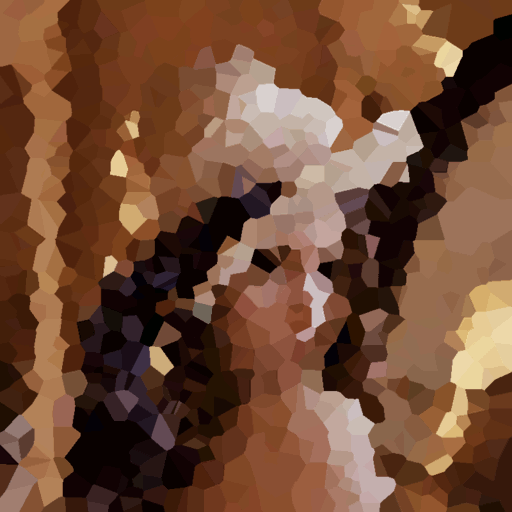

# Voronoi Diagram Mosaics

Create mosaics using voronoi diagrams

##Compile It

Depends on openGL headers.  On debian based systems:

sudo apt-get install mesa-common-dev  
sudo apt-get install libglu1-mesa-dev  
sudo apt-get install freeglut3-dev  

make

##Run It

./VoronoiDiagramMosaics <input.ppm>  

##Notes

You need the openGL headers installed.  Tested for linux.  Should compile for both mac and linux.
